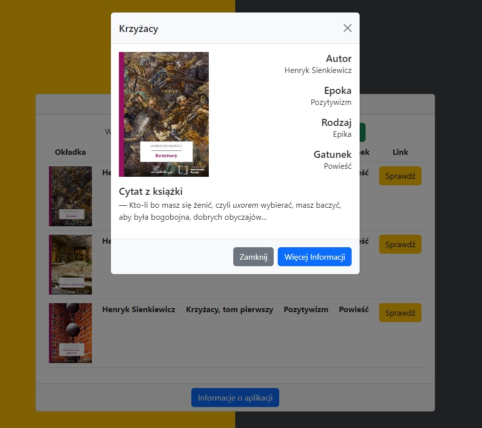

# :desktop_computer: BookAPP

The application allows users to search for only Polish books based on the entered title and presents the most important information about a given book. After displaying the results, the user can decide whether they want to learn more details by clicking the appropriate button. They will be presented with a short quote and the most important information about the book. Additionally, the user has the option to navigate to the wolnelektury.pl website to learn more about the selected book.

The application use the Wolne Lektury API.

## :framed_picture: Screenshots

## :joystick: Demo

https://kamilkeder.github.io/BookAPP/

## :e-mail: Feedback

If you have any feedback, please reach out to me at kontaktkkeder@gmail.com
